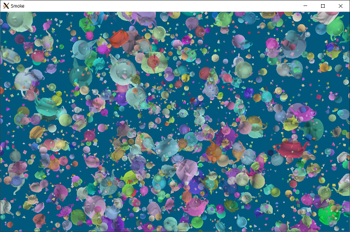
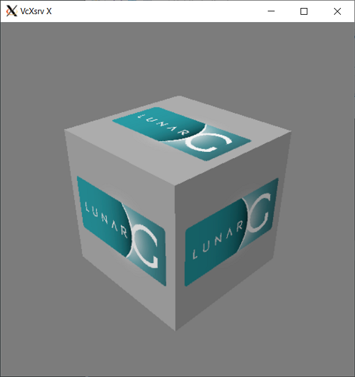

This is work in progress...

## lavapipe for WSL

This repo (https://github.com/gnsmrky/mesa-wsl) is based on [mesa3d repo 20.3](https://github.com/mesa3d/mesa/tree/20.3), the first official release includes `lavapipe`.  `lavapipe` is the Vulkan frontend in mesa that uses `llvmpipe` as software renderer.

The original `lavapipe` does not support Windows Subsystem for Linux (WSL) in Windows 10.  This repo adds workarounds to allow `lavapipe` to work in WSL and display via VcXsrv (a XDisplay server for Windows).

## Pre-built binaries
(WIP)

## Build WSL with Ubuntu 18.04 or 20.04
Open WSL with Ubuntu 18.04 or 20.04.

1. #### Update and install needed packages for development.  
   ```
   sudo apt update
   
   sudo apt install build-essential git python3-pip pkg-config llvm \
   valgrind vainfo bison flex llvm libdrm-dev libxdamage-dev libx11-dev \
   libx11-xcb-dev libxext-dev libxcb-glx0-dev libxcb-dri2-0-dev \
   libxcb-dri3-dev libxcb-present-dev libxcb-shm0-dev libxshmfence-dev \
   libxxf86vm-dev x11-xserver-utils libxrandr-dev
   ```
   
1. #### Setup python in WSL.
   - Environment vars   
     ```
     alias python=python3 &&
     alias pip=pip3 &&
     export PATH=~/.local/bin:$PATH
     ```

   - Install python3 packages.  
     `pip install meson ninja cmake mako`

1. #### Get this repo and prepare for build env
   - Get the repo  
     `git clone https://github.com/gnsmrky/mesa-wsl`
   - Change directory to the repo and create & change to `build` folder.
      ```
      cd mesa-wsl
      mkdir build
      cd build
      ```

1. #### In `build` folder, config & build mesa.
   - This sets the target folder at `~/mesa_local`.
     ```
     meson -Dprefix=~/mesa-local -Ddri-drivers= -Dglx=dri -Dllvm=enabled \
     -Ddri-driver-path=/usr/local/lib/x86_64-linux-gnu/dri \
     -Dgallium-drivers="swrast" -Dplatforms=x11 -Dosmesa=gallium \
     -Dvulkan-drivers=swrast ..
     ```
   - Build mesa  
     `ninja`

   - Install mesa to target folder `~/mesa-local`.  
     `ninja install`

1. #### Install mesa to WSL.
   - Copy mesa build files from `~/mesa-local` to `/usr` folder.  
     Warning: This will replace mesa files in WSL!  
     `sudo copy -R ~/mesa-local /usr`

1. #### Config `VcXsrv` for WSL Vulkan.
   - Launch `VcXsrv` on Windows 10. Upon launching, set the following:  
     - Select `Multiple window`.
     - Set `Display number` to `1`.
     - Select `Start no client` (should be default setting).
     - Disable `Native opengl`.
   - In WSL, set `DISPLAY` envar to `1`.  
     `export DISPLAY=:1`

1. #### Validate and run Vulkan tools.
   - On WSL Ubuntu 18.04, install and run `vulkaninfo`   
     ```
     sudo apt install vulkan-utils
     vulkaninfo | grep llvmpipe
     ```

     Returns the following:
     ```
     WARNING: lavapipe is not a conformant vulkan implementation, testing use only.
                GPU id       : 0 (llvmpipe (LLVM 6.0.0, 256 bits))
                GPU id       : 0 (llvmpipe (LLVM 6.0.0, 256 bits))
                GPU id       : 0 (llvmpipe (LLVM 6.0.0, 256 bits))
                GPU id       : 0 (llvmpipe (LLVM 6.0.0, 256 bits))
                GPU id       : 0 (llvmpipe (LLVM 6.0.0, 256 bits))
                GPU id       : 0 (llvmpipe (LLVM 6.0.0, 256 bits))
     GPU id       : 0 (llvmpipe (LLVM 6.0.0, 256 bits))
        deviceName     = llvmpipe (LLVM 6.0.0, 256 bits)
     ```
     - Also `vulkan-smoketest`.  
     

   - On WSL Ubuntu 20.04, install and run `vkcube`.  
     ```
     sudo apt install vulkan-tools
     vulkaninfo
     ```

     Returns the following:
     ```
     WARNING: lavapipe is not a conformant vulkan implementation, testing use only.
                GPU id  : 0 (llvmpipe (LLVM 10.0.0, 256 bits))
                GPU id  : 0 (llvmpipe (LLVM 10.0.0, 256 bits))
     GPU id : 0 (llvmpipe (LLVM 10.0.0, 256 bits)):
                        llvmpipe (LLVM 10.0.0, 256 bits) (ID: 0)
        deviceName     = llvmpipe (LLVM 10.0.0, 256 bits)
        driverName         = llvmpipe
     ```

     - Also run `vkcube`   
     

## References
1. `lavapipe` FAQ: [lavapipe: a *software* swrast vulkan layer FAQ
August 20, 2020](https://airlied.blogspot.com/2020/08/vallium-software-swrast-vulkan-layer-faq.html)

1. 